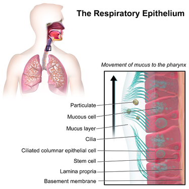

<h2>Table of Contents</h2>

<ul>
<li><a href="#orgheadline14">1. Epidemics</a>
<ul>
<li><a href="#orgheadline13">1.1. Diseases and the Networks That Transmit Them</a>
<ul>
<li><a href="#orgheadline6">1.1.1. Properties of Patterns of Epidemics spread through groups of people</a></li>
<li><a href="#orgheadline7">1.1.2. Connections to the Diffusion of Ideas and Behaviors -and  Differences</a></li>
<li><a href="#orgheadline12">1.1.3. Insight Basic Probablistic (random infection) model provide on Epidemics</a></li>
</ul>
</li>
</ul>
</li>
<li><a href="#orgheadline22">2. Research Notes On Topics</a>
<ul>
<li><a href="#orgheadline21">2.1. Air filteration</a>
<ul>
<li><a href="#orgheadline20">2.1.1. Computer simulation of air filtration including electricsurface charges in three-dimensional fibrous microstructures</a></li>
</ul>
</li>
</ul>
</li>
<li><a href="#orgheadline23">3. Testing For The Virus</a></li>
<li><a href="#orgheadline36">4. Pathogen</a>
<ul>
<li><a href="#orgheadline25">4.1. Vaccine Development</a>
<ul>
<li><a href="#orgheadline24">4.1.1. NIH clinical trial of investigational vaccine for COVID-19 begins</a></li>
</ul>
</li>
<li><a href="#orgheadline35">4.2. Defensive Measures</a>
<ul>
<li><a href="#orgheadline26">4.2.1. Silver Nanoparticles: Synthesis and Application for Nanomedicine</a></li>
<li><a href="#orgheadline27">4.2.2. Silver Nanoparticles as Potential Antiviral Agents</a></li>
<li><a href="#orgheadline28">4.2.3. Reduced Graphene Oxide-Silver Nanoparticle Nanocomposite: A Potential Anticancer Nanotherapy</a></li>
<li><a href="#orgheadline29">4.2.4. Ag and Au nanoparticles/reduced graphene oxide composite materials: Synthesis and application in diagnostics and therapeutics</a></li>
<li><a href="#orgheadline30">4.2.5. Graphene - and Graphene Oxide-Based Nanocomposite Platforms for Electrochemical Biosensing Applications</a></li>
<li><a href="#orgheadline31">4.2.6. Quercetin-mediated synthesis of graphene oxide–silver nanoparticle nanocomposites: a suitable alternative nanotherapy for neuroblastoma</a></li>
<li><a href="#orgheadline32">4.2.7. Synthesis, Characterization and Antimicrobial Properties of Silver Nanocomposites</a></li>
<li><a href="#orgheadline33">4.2.8. Printable nanocomposites of polymers and silver nanoparticles for antibacterial devices produced by DoD technology</a></li>
<li><a href="#orgheadline34">4.2.9. Greener Synthesis, Characterization, and Antimicrobiological Effects of Helba Silver Nanoparticle-PMMA Nanocomposite</a></li>
</ul>
</li>
</ul>
</li>
<li><a href="#orgheadline37">5. Glossary</a></li>
</ul>

# Epidemics

## Diseases and the Networks That Transmit Them

The pathogen and the network are closely intertwined: enven within the same population, the contact networks,
 for two different diseases can have very different structures, depending dieseases' respctive modes of transmissions.

-   STDs versus the Cold

### Properties of Patterns of Epidemics spread through groups of people

1.  Determined by:

    1.  Pathogen
    
        -   contagiousness
        -   the length of its infectious period
        -   severity
    
    2.  The network structure (Of the population affected)
    
        1.  The social network (who knows who)
        
        2.  The contact network

### Connections to the Diffusion of Ideas and Behaviors -and  Differences

The assumption is that when two people are directly linked in the contact network, and one of them has the diesease,
there is a given probablility that he or she will pass it to the other.
We have no simple models - so we abstract away the mechanism by modeling it as random.
This is the lack of decision making and modeling it as random odds of infection is the concrete difference between modeling
of a biological versus a social contagion.

-   Spread from person to person
-   What about surfaces?
-   No decision making process in how a diesease infects a person
-   Infection process is unobservable

Models based on random process in network/graphs are used to model Epidemics

### Insight Basic Probablistic (random infection) model provide on Epidemics

1.  Qualitative Aspect involving Spread of Diesease

    1.  Sychronization
    
    2.  Timing
    
    3.  Concurrency in Transmission
    
        Deeper unknowns at this point
        
        Randomized models can also sometimes be useful in studing social contagion, particularly in cases where the underlying decision
        process of individuals are hard to model and hence more usefully abstracted as radom processes.  Often the two approaches - decision
        based  and probablistic produce related reults and can sometimes be used in connection.
        
        Understanding the relationship between these methodlogies at a deeper level is an interesting direction for further research.
        
        MB Idea: This probably where the concepts from Judea Pearls Causality start to connect.  Causal Contact Networks (CCN) could be constructed
        to better understand how different populations behaviour (actions taken not taken) affected the outcome of the diesease.
        
        Use dowhy module to model and provided "attributions" to the vertices(nodes) and edges
        Use git to model various branching scenarios.

# Research Notes On Topics

## Air filteration

### [Computer simulation of air filtration including electricsurface charges in three-dimensional fibrous microstructures](https://www.geodict.com/Presentations/2005FiltechWiesbadenElectricSurfaceRiefPaper.pdf)

This might provide a start point

1.  Layered Media Model

2.  Flow Simulation

3.  Model of surface charges and computation of electric field

4.  Filter efficiency simulation

5.  Filter lifetime simulation

# Testing For The Virus

[Silver Nano Particles](https://en.wikipedia.org/wiki/Silver_nanoparticle)

# Pathogen

 emerging from the surface of cells cultured in the lab. SARS-CoV-2, also known as 2019-nCoV, is the virus that causes COVID-19. The virus shown was isolated from a patient in the U.S.")

## Vaccine Development

### [NIH clinical trial of investigational vaccine for COVID-19 begins](https://www.nih.gov/news-events/news-releases/nih-clinical-trial-investigational-vaccine-covid-19-begins)

## Defensive Measures

### [Silver Nanoparticles: Synthesis and Application for Nanomedicine](https://www.ncbi.nlm.nih.gov/pmc/articles/PMC6412188/)

### [Silver Nanoparticles as Potential Antiviral Agents](https://www.ncbi.nlm.nih.gov/pmc/articles/PMC6264685/)

### [Reduced Graphene Oxide-Silver Nanoparticle Nanocomposite: A Potential Anticancer Nanotherapy](https://pubmed.ncbi.nlm.nih.gov/26491296/)

### [Ag and Au nanoparticles/reduced graphene oxide composite materials: Synthesis and application in diagnostics and therapeutics](https://www.sciencedirect.com/science/article/pii/S0001868619301010?via%3Dihub)

### [Graphene - and Graphene Oxide-Based Nanocomposite Platforms for Electrochemical Biosensing Applications](https://www.ncbi.nlm.nih.gov/pmc/articles/PMC6628170/)

### [Quercetin-mediated synthesis of graphene oxide–silver nanoparticle nanocomposites: a suitable alternative nanotherapy for neuroblastoma](https://www.ncbi.nlm.nih.gov/pmc/articles/PMC5566358/)

### [Synthesis, Characterization and Antimicrobial Properties of Silver Nanocomposites](https://www.intechopen.com/books/silver-nanoparticles-fabrication-characterization-and-applications/synthesis-characterization-and-antimicrobial-properties-of-silver-nanocomposites)

### [Printable nanocomposites of polymers and silver nanoparticles for antibacterial devices produced by DoD technology](https://journals.plos.org/plosone/article?id=10.1371/journal.pone.0200918)

### [Greener Synthesis, Characterization, and Antimicrobiological Effects of Helba Silver Nanoparticle-PMMA Nanocomposite](https://www.hindawi.com/journals/ijps/2019/4379507/)

# Glossary

assay: the testing of a metal or ore to determine its ingredients and quality.
[Respiratory epithelium](https://en.wikipedia.org/wiki/Respiratory_epithelium) - Ciliated columnar epithelium found lining most of the respiratory tract as respiratory mucosa, Moistens and protect the airways.

